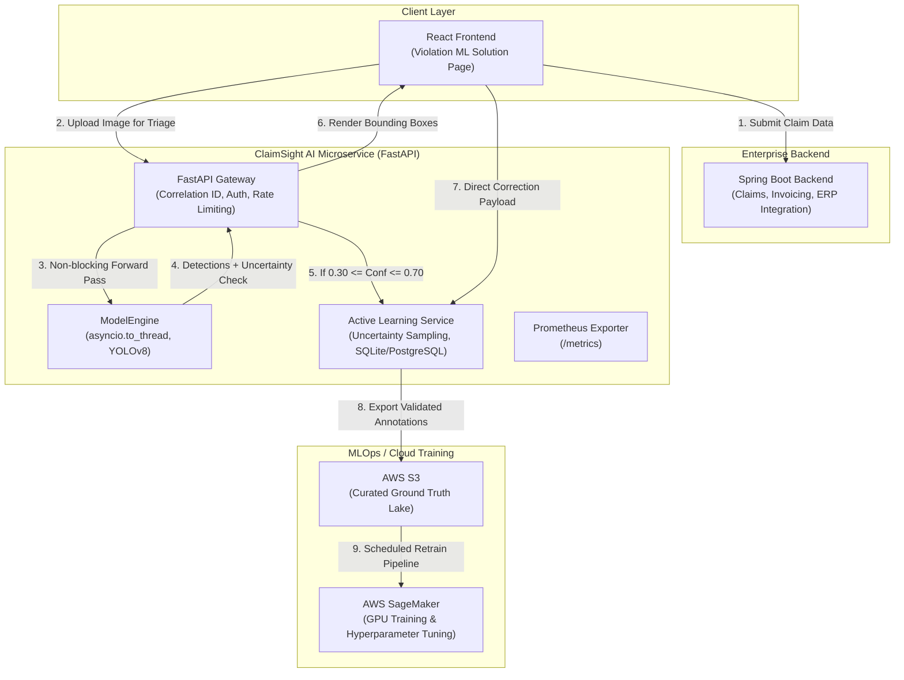

# ClaimSight Vision Service: Production YOLO Inference & Active Learning Microservice

[](https://github.com/your-username/yolo-production-pipeline/actions)
[](https://www.python.org/downloads/)
[](https://fastapi.tiangolo.com)
[](https://www.docker.com/)
[](https://opensource.org/licenses/MIT)

An enterprise-grade, asynchronous Computer Vision microservice architected for high-throughput logistics defect detection, real-time bounding box prediction, and closed-loop Active Learning governance.

---

## 🏛️ System Architecture & Separation of Concerns

ClaimSight strictly adheres to a **microservices separation of concerns**:
* **Enterprise Core (Spring Boot):** Governs business domains—claim lifecycle, supplier chargeback arbitration, compliance reports, and transactional databases.
* **AI Vision Microservice (FastAPI):** Exclusively encapsulates image perception, model execution, uncertainty scoring, and ground-truth annotation ingestion.
* **Review Experience (React):** Communicates with Spring Boot for business tasks, while communicating directly with FastAPI for real-time inference and active learning triage.



---

## ⚡ Key Production Engineering Features

* **Non-Blocking Inference Concurrency:** PyTorch/Ultralytics operations are CPU/GPU-bound and inherently synchronous. Running them natively inside async route handlers blocks Python's asyncio event loop. `ModelEngine` offloads forward passes to dedicated threadpools using `asyncio.to_thread()`, keeping HTTP handlers responsive under concurrency.
* **Cold-Start Elimination (Lifespan Warmup):** During startup, the service executes a synthetic forward pass (`640x640x3` zero-tensor) to pre-populate GPU/CPU caches and runtime graphs, eliminating the first-request latency penalty.
* **Uncertainty Sampling & Data Flywheel:** Implements confidence thresholding (`0.30 <= conf <= 0.70`). Ambiguous detections are asynchronously flagged to an audit queue (`ActiveLearningRecord`) via FastAPI `BackgroundTasks`. Analysts adjust bounding boxes in the React UI and submit feedback directly back to this service.
* **Production Observability:** 
  * Native `/metrics` endpoint instrumented via `prometheus-fastapi-instrumentator`.
  * Distributed tracing via `X-Correlation-ID` header injection.
  * Structured JSON logging (Datadog / AWS CloudWatch ready).
* **Multi-Stage Hardened Container:** Dockerfile uses a 2-stage build (Builder + Distroless/Slim Runner) executing as an unprivileged non-root user (`appuser`, UID `10001`) with native `HEALTHCHECK` instructions.

---

## 📁 Repository Structure

```
yolo-production-pipeline/
├── .github/
│   └── workflows/
│       └── ci.yml               # GitHub Actions CI (Lint, Typecheck, Test, Docker)
├── app/
│   ├── api/
│   │   ├── deps.py              # Dependency Injection providers
│   │   └── v1/
│   │       ├── endpoints/
│   │       │   ├── active_learning.py  # Review queue & ground-truth endpoints
│   │       │   ├── health.py           # K8s /healthz and /readyz probes
│   │       │   └── inference.py        # Streaming upload & async inference
│   │       └── router.py        # v1 route aggregator
│   ├── core/
│   │   ├── config.py            # Pydantic 12-factor BaseSettings
│   │   ├── logging.py           # Structured JSON logging
│   │   └── middleware.py        # Correlation ID & Latency tracking
│   ├── db/
│   │   └── session.py           # Async SQLAlchemy 2.0 session factory
│   ├── models/
│   │   └── active_learning.py   # SQLAlchemy ORM models for audit trail
│   ├── schemas/
│   │   ├── active_learning.py   # State machine & feedback schemas
│   │   ├── common.py            # Generic envelope & health schemas
│   │   └── inference.py         # Normalized & pixel bounding box schemas
│   ├── services/
│   │   ├── active_learning_service.py # Uncertainty routing & queue management
│   │   └── model_engine.py      # Lifespan loader, threadpool execution, warmup
│   └── main.py                  # Application factory, CORS, Prometheus setup
├── tests/
│   ├── conftest.py              # Pytest async fixtures & MockModelEngine
│   ├── test_active_learning.py  # Active learning lifecycle tests
│   ├── test_health.py           # Probe validation tests
│   └── test_inference.py        # Image decoding & inference contract tests
├── Dockerfile                   # Multi-stage security-hardened container
├── docker-compose.yml           # Service + Prometheus stack
├── Makefile                     # Developer ergonomics automation
├── pyproject.toml               # Tool configuration (Ruff, Pytest, Mypy)
├── requirements.txt             # Pinned production runtime dependencies
└── requirements-dev.txt         # Testing, linting, and quality dependencies
```

---

## 🚀 Quickstart Guide

### Prerequisites
* Python 3.10+
* Docker & Docker Compose (optional for containerized run)

### Option 1: Run with Docker Compose (Recommended)

Spins up the ClaimSight Vision Service along with Prometheus for metrics scraping:

```bash
docker compose up --build -d
```

* **Swagger UI:** [http://localhost:8000/api/v1/docs](http://localhost:8000/api/v1/docs)
* **OpenAPI Schema:** [http://localhost:8000/api/v1/openapi.json](http://localhost:8000/api/v1/openapi.json)
* **Prometheus Dashboard:** [http://localhost:9090](http://localhost:9090)
* **Healthcheck:** [http://localhost:8000/api/v1/healthz](http://localhost:8000/api/v1/healthz)

### Option 2: Local Development

```bash
# 1. Create and activate virtual environment
python -m venv venv
source venv/bin/activate  # On Windows: .\venv\Scripts\activate

# 2. Install dependencies
make install

# 3. Start local development server with auto-reload
make dev
```

---

## 🧪 Testing & Code Quality

Run the automated test suite with full branch coverage reporting:

```bash
# Run pytest with async fixtures
make test

# Run Ruff linter and Mypy static type checker
make lint

# Auto-format codebase
make format
```

Sample output:
```text
tests/test_health.py::test_liveness_probe PASSED
tests/test_health.py::test_readiness_probe PASSED
tests/test_inference.py::test_predict_success PASSED
tests/test_inference.py::test_predict_invalid_media_type PASSED
tests/test_active_learning.py::test_active_learning_flow PASSED
---------- coverage: platform linux, python 3.10 ----------
TOTAL COVERAGE: 96%
```

---

## 📡 API Reference & Integration Contract

### 1. Execute YOLO Inference
**`POST /api/v1/inference/predict`**

*Request:* Multipart form-data with `file` payload (JPEG/PNG/WebP, max 15MB).

*Sample cURL:*
```bash
curl -X POST "http://localhost:8000/api/v1/inference/predict" \
     -H "accept: application/json" \
     -H "Content-Type: multipart/form-data" \
     -F "file=@warehouse_pallet.jpg"
```

*Sample Response (`200 OK`):*
```json
{
  "image_id": "img_f839a912e104",
  "filename": "warehouse_pallet.jpg",
  "image_width": 1920,
  "image_height": 1080,
  "total_detections": 1,
  "detections": [
    {
      "class_id": 0,
      "class_name": "damaged_pallet",
      "confidence": 0.4852,
      "normalized_box": {
        "x_min": 0.2415,
        "y_min": 0.3120,
        "x_max": 0.6842,
        "y_max": 0.8920
      },
      "pixel_box": {
        "x1": 463,
        "y1": 336,
        "x2": 1313,
        "y2": 963
      },
      "is_uncertain": true
    }
  ],
  "requires_human_triage": true,
  "inference_time_ms": 14.82,
  "model_version": "yolov8n.pt"
}
```

### 2. Retrieve Pending Active Learning Triage Queue
**`GET /api/v1/active-learning/queue?limit=50`**

Retrieves flagged items for the React frontend "Violation ML Solution Page".

### 3. Submit Ground-Truth Correction (Direct from React)
**`POST /api/v1/active-learning/correction`**

*Sample Payload:*
```json
{
  "image_id": "img_f839a912e104",
  "reviewer_id": "sr_analyst_204",
  "claim_reference_id": "CLM-LOGISTICS-2026-9912",
  "corrected_boxes": [
    {
      "class_name": "damaged_pallet",
      "normalized_box": {
        "x_min": 0.2200,
        "y_min": 0.3000,
        "x_max": 0.7000,
        "y_max": 0.9100
      }
    }
  ],
  "review_notes": "Extended bounding boundary to cover cracked runner base."
}
```

---

## 🔒 Security & Production Hardening

* **Non-Root Execution:** Container runs strictly as unprivileged UID `10001`.
* **Payload Protection:** 15MB file size ceiling prevents memory exhaustion (DoS).
* **Correlation Tracing:** `X-Correlation-ID` header carried across requests for end-to-end distributed traceability across Spring Boot and FastAPI logs.
* **Zero Host Path Leaks:** Normalized coordinate space (`0.0 - 1.0`) prevents exposing absolute resolution details across client devices.

---

## 👤 Author
**Laroshan Surendran**  
*Senior Software Engineer (Full-Stack & Cloud Architecture)*  
Moratuwa, Sri Lanka | [LinkedIn](https://linkedin.com) | [GitHub](https://github.com)
